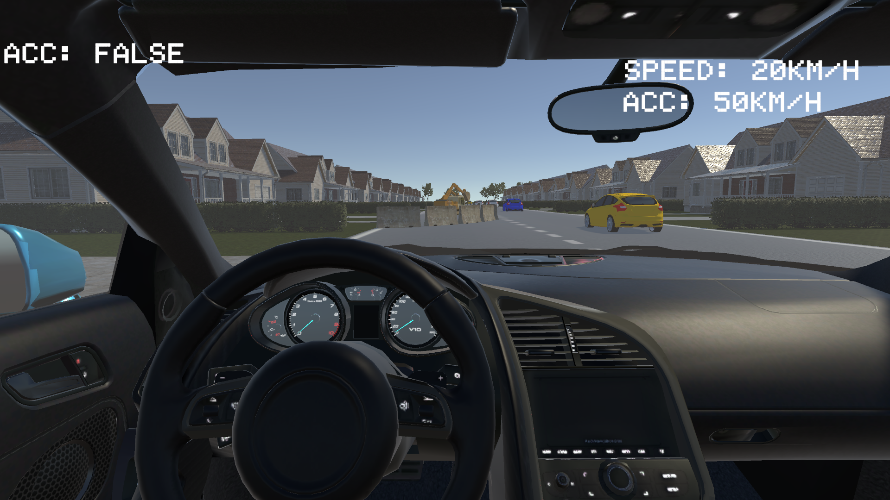

A Unity-based car simulation project for university research, designed to evaluate the advantages of Adaptive Cruise Control (ACC) in two driving scenarios. The simulation collects data and user experiences from a small group of participants.

---

## Overview

This project provided an interactive car driving experience where users drove in two modes:

1. **Without ACC:** Manual control of the car's speed and distance.
2. **With ACC:** ACC system assists the driver by automatically maintaining speed and safe distance from vehicles ahead.

The aim is to assess the potential benefits and usability of ACC for drivers.

---

## Features

- Car controls
- Toggle ACC on/off during the simulation
- Data collection for scenario comparison

---

## How to Run

1. **Download the build:**
   - `build/CarRacing.exe`

2. **Run the simulation:**
   - Double-click `CarRacing.exe` to start the program (Windows only).
   
3. **Follow on-screen instructions:**
   - Choose one of two test scenarios or go in freeplay mode and drive.

---

## Screenshot

---

## Research Information

This project was created for a university study to compare driver experience and performance with and without ACC.

---

## Requirements

- Windows PC
- Keyboard (for controls)

---

## Controls

- **Arrow keys / WASD:** Drive and steer the car
- **Space:** Brake
- **B:** Toggle ACC on/off
- **ESC:** To return to the mainmenu

---

## Credits

- Developed by Mukhtar Muse and Mattis Buehler in University Ulm

---